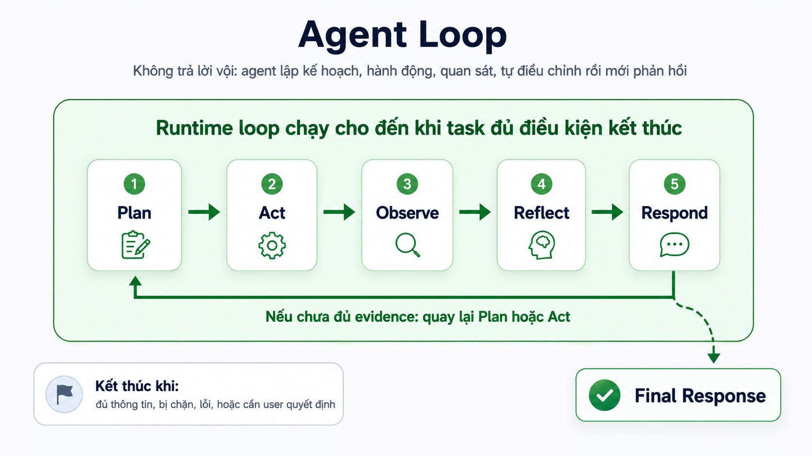

# 03. Agent Loop

## Mục tiêu

Sau bài này, người học cần hiểu được:

1. Agent Loop là gì và vì sao nó là lõi của OVTeleport.
2. Năm phase `Plan`, `Act`, `Observe`, `Reflect`, `Respond` khác nhau thế nào.
3. Vì sao agent cần lặp thay vì trả lời ngay.
4. Khi nào loop nên tiếp tục, khi nào nên dừng và trả final response.

Bài 02 đã đặt Agent Loop ở trung tâm core flow. Bài này đi sâu vào chính vòng lặp đó.

## Vì sao cần Agent Loop?

Chatbot thường nhận prompt rồi sinh câu trả lời. Cách này phù hợp với câu hỏi ngắn, nhưng không đủ cho task cần evidence hoặc nhiều bước.

Ví dụ user yêu cầu:

```text
Audit module login và cho tôi kế hoạch fix.
```

Nếu trả lời ngay, agent rất dễ đoán. Một agent tốt cần biết:

- File login nằm ở đâu?
- Có dependency nào liên quan đến session, password hoặc middleware không?
- Test hiện có đang cover những case nào?
- Có cần chạy command không?
- Evidence đã đủ để kết luận chưa?

Agent Loop giúp runtime biến một request lớn thành chuỗi bước có thể kiểm soát: lập kế hoạch, hành động, quan sát, tự điều chỉnh và chỉ phản hồi khi đủ điều kiện.

## Mô hình nền tảng

Agent Loop có năm phase:

```text
Plan -> Act -> Observe -> Reflect -> Respond
```

Loop này có thể chạy một lần hoặc nhiều lần. Nếu chưa đủ evidence, agent quay lại `Plan` hoặc `Act`. Nếu bị chặn bởi permission, lỗi hoặc thiếu quyết định từ user, loop phải dừng đúng trạng thái thay vì tiếp tục đoán.

## Sơ đồ Agent Loop



Sơ đồ này nhấn mạnh hai ý:

- Agent không trả lời vội. Nó đi qua các bước trước khi respond.
- `Respond` chưa chắc là kết thúc. Nếu chưa đủ evidence, runtime có thể quay lại `Plan` hoặc `Act`.

## 1. Plan

`Plan` là bước agent hiểu mục tiêu và chọn hướng xử lý ban đầu.

Với request:

```text
Audit module auth.
```

Plan tốt cần trả lời:

- User đang muốn output gì: audit report, fix plan hay code change?
- Cần kiểm tra file nào trước?
- Có dependency hoặc test liên quan không?
- Có hành động nào cần permission không?

Plan không cần dài. Plan tốt là plan đủ để chọn hành động tiếp theo. Nếu plan quá chi tiết khi chưa có evidence, agent dễ khóa mình vào giả định sai.

Ví dụ plan ngắn:

```text
1. Tìm file liên quan đến auth/login.
2. Đọc implementation chính.
3. Đọc test và dependency liên quan.
4. Tổng hợp rủi ro và kế hoạch fix.
```

## 2. Act

`Act` là bước agent chọn hành động tiếp theo.

Hành động có thể là:

- Gọi tool search file.
- Đọc file.
- Chạy command nếu được phép.
- Gọi LLM provider để phân tích hoặc tóm tắt.
- Đọc lại context.
- Hỏi user khi thiếu thông tin hoặc thiếu permission.

Ví dụ:

```text
Act: search file có tên login.
Act: read src/auth/login.ts.
Act: ask permission để chạy pnpm test auth.
```

Trong OVTeleport, hành động có side effect phải đi qua tool calling system và permission boundary. Agent không nên tự ý chạy command rủi ro chỉ vì model “muốn thử”.

## 3. Observe

`Observe` là bước agent nhận kết quả thật từ hành động vừa chạy.

Ví dụ output từ tool search:

```text
src/auth/login.ts
src/auth/session.ts
test/auth/login.test.ts
```

Observation là evidence. Đây là điểm giúp agent khác chatbot đoán mò. Agent phải dùng observation để cập nhật hiểu biết của mình:

- File nào tồn tại?
- Command pass hay fail?
- Output có lỗi gì?
- Tool bị deny hay cần permission?
- Output có quá dài và cần tóm tắt không?

Nếu observation không được đưa vào loop đúng cách, agent có thể tiếp tục hành động dựa trên giả định cũ.

## 4. Reflect

`Reflect` là bước agent đánh giá observation và quyết định hướng tiếp theo.

Các câu hỏi chính:

- Evidence đã đủ để trả lời chưa?
- Có mâu thuẫn với giả định ban đầu không?
- Cần đọc thêm file nào?
- Có cần chạy test không?
- Có lỗi permission, tool failure hoặc output quá lớn không?
- Nên tiếp tục, hỏi user hay final?

Reflect giúp agent không gọi tool mù quáng. Đây là nơi plan được cập nhật.

Ví dụ:

```text
Observation: tìm thấy login.ts và login.test.ts.
Reflect: cần đọc thêm session.ts vì login tạo session token.
Next act: read src/auth/session.ts.
```

## 5. Respond

`Respond` là bước agent tổng hợp câu trả lời cho user.

Respond chỉ nên xảy ra khi agent có đủ cơ sở hoặc khi cần báo rõ trạng thái bị chặn.

Một response tốt cần:

- Trả lời đúng yêu cầu ban đầu.
- Nêu kết luận trước.
- Tóm tắt evidence quan trọng.
- Không dán log thô nếu không cần.
- Nêu file, command hoặc observation liên quan khi cần.
- Đề xuất bước tiếp theo nếu task chưa hoàn tất.

Nếu task bị chặn, response cũng phải nói rõ bị chặn ở đâu:

```text
Không thể chạy test vì command cần permission.
Tôi đã đọc login.ts và login.test.ts; hiện có đủ evidence cho phần audit tĩnh, nhưng chưa xác nhận runtime test.
```

## Khi nào loop tiếp tục?

Agent Loop nên tiếp tục khi:

- Observation chưa đủ để kết luận.
- Có file hoặc dependency quan trọng chưa đọc.
- Tool result gợi ý hướng kiểm tra mới.
- Có lỗi cần retry theo cách khác.
- User yêu cầu output cần bằng chứng mạnh hơn.

Ví dụ:

```text
Đọc login.ts thấy createSession(user.id).
=> Cần đọc session.ts trước khi kết luận về session security.
```

## Khi nào loop dừng?

Loop nên dừng khi:

- Đã đủ evidence để trả lời.
- Bị chặn bởi permission.
- Gặp lỗi không thể tự xử lý an toàn.
- Cần user chọn hướng xử lý.
- Task đã hoàn thành.

Dừng đúng lúc quan trọng không kém tiếp tục đúng lúc. Agent tốt không chạy tool vô hạn chỉ để “chắc hơn”.

## Ví dụ: audit module login

User:

```text
Audit module login và cho tôi kế hoạch fix.
```

Một trace đơn giản:

| Step | Phase | Nội dung |
|---|---|---|
| 1 | Plan | Cần tìm implementation, dependency và test của login |
| 2 | Act | Search file `login` |
| 3 | Observe | Tìm thấy `login.ts`, `session.ts`, `login.test.ts` |
| 4 | Reflect | Cần đọc cả session vì login tạo session token |
| 5 | Act | Read `login.ts`, `session.ts`, `login.test.ts` |
| 6 | Observe | Test có success/failure cơ bản, chưa thấy brute force/lockout |
| 7 | Reflect | Evidence đủ để nêu rủi ro thiếu rate limit và thiếu test coverage |
| 8 | Respond | Trả audit report và kế hoạch fix |

Điểm cần thấy: agent không trả lời ngay sau prompt. Nó đi qua action và observation trước khi kết luận.

## Lỗi hiểu sai cần tránh

1. **Plan càng dài càng tốt**  
   Sai. Plan nên đủ để chọn bước tiếp theo. Plan quá dài trước khi có evidence dễ sai.

2. **Act nghĩa là luôn gọi tool**  
   Không hẳn. Act có thể là gọi tool, gọi provider, đọc context hoặc hỏi user.

3. **Observe chỉ là nhận output**  
   Chưa đủ. Observation phải được hiểu và đưa trở lại loop để cập nhật hướng xử lý.

4. **Reflect là suy nghĩ trang trí**  
   Sai. Reflect là bước quyết định tiếp tục, đổi hướng, hỏi user hay final.

5. **Respond luôn là kết thúc thành công**  
   Không. Respond cũng có thể là báo bị chặn, báo cần permission hoặc tóm tắt trạng thái hiện tại.

## Câu cần nhớ

```text
Agent Loop = không đoán ngay.
Plan -> Act -> Observe -> Reflect -> Respond.
Nếu chưa đủ evidence, quay lại Plan hoặc Act.
```

Agent Loop biến LLM từ một bộ sinh text thành một worker có quy trình: biết lập kế hoạch, hành động có kiểm soát, quan sát kết quả, tự điều chỉnh và tổng hợp câu trả lời.
