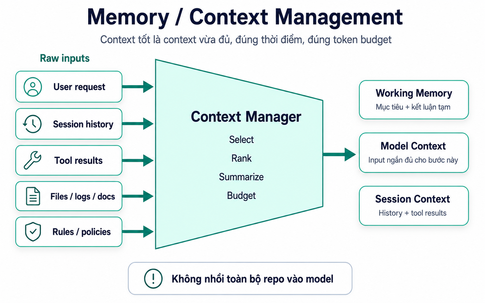

# 05. Memory / Context

## Mục tiêu

Sau bài này, người học cần hiểu được:

1. `Memory` và `Context` khác nhau thế nào.
2. Vì sao không nên nhồi toàn bộ dữ liệu vào model.
3. Context Manager chọn thông tin cho Agent Loop ra sao.
4. Working Memory, Model Context và Session Context có vai trò gì.

Bài 04 đã nói tool calls tạo ra evidence. Bài này trả lời câu hỏi tiếp theo: **evidence, history và rules được đưa vào agent như thế nào để model dùng đúng lúc, không bị quá tải?**

## Ý tưởng trung tâm

Memory và context giúp agent giữ mạch làm việc.

Nhưng điều đó không có nghĩa là:

```text
Đưa toàn bộ lịch sử chat + toàn bộ repo + toàn bộ tool output vào model.
```

Context tốt là context:

- Đúng với task hiện tại.
- Đủ để ra quyết định tiếp theo.
- Ngắn vừa token budget.
- Không làm model bị nhiễu bởi dữ liệu không liên quan.

Nói ngắn gọn:

```text
Context tốt không phải là context nhiều nhất.
Context tốt là context vừa đủ, đúng thời điểm.
```

## Sơ đồ Context Management



Sơ đồ này thể hiện vai trò của `Context Manager`.

Ở bên trái là raw inputs:

- User request.
- Session history.
- Tool results.
- Files / logs / docs.
- Rules / policies.

Ở giữa là Context Manager:

- Select.
- Rank.
- Summarize.
- Budget.

Ở bên phải là các dạng context agent cần:

- Working Memory.
- Model Context.
- Session Context.

Điểm quan trọng: Context Manager không gom mọi thứ rồi ném vào model. Nó chọn đúng phần cần thiết cho bước hiện tại.

## Context là gì?

Context là thông tin được đưa vào hoặc được dùng bởi agent ở một bước xử lý cụ thể.

Context có thể gồm:

- User request hiện tại.
- Lịch sử session liên quan.
- File vừa đọc.
- Tool result gần đây.
- Kết luận tạm thời.
- Quy tắc permission.
- Instruction hoặc policy cần tuân thủ.

Ví dụ khi audit login, context hữu ích có thể là:

```text
User request: audit module login.
Files đã đọc: login.ts, session.ts, login.test.ts.
Observation: test hiện có chỉ cover success/failure cơ bản.
Kết luận tạm: chưa thấy rate limit hoặc lockout test.
```

Context không phải toàn bộ dữ liệu hệ thống. Context là phần agent cần để ra quyết định tiếp theo.

## Memory là gì?

Memory là thông tin được giữ lại để agent không phải bắt đầu từ số không.

Memory có thể nằm trong nhiều tầng:

- Working Memory: thông tin đang dùng cho task hiện tại.
- Session Context: lịch sử và state của phiên làm việc.
- Long-term Memory: thông tin có thể dùng lại qua nhiều session, nếu hệ thống hỗ trợ.

Memory giúp agent giữ mạch. Nhưng memory sai, quá cũ hoặc quá rộng cũng có thể làm agent đi sai hướng.

## Working Memory

Working Memory là phần agent đang cần ngay trong task hiện tại.

Ví dụ:

```text
Task hiện tại: audit module login.
Mục tiêu output: vấn đề, mức độ nghiêm trọng, file liên quan, kế hoạch fix.
File đã đọc: login.ts, session.ts, login.test.ts.
Kết luận tạm: thiếu rate limit và thiếu test repeated failures.
Next step: tổng hợp audit report.
```

Working Memory thường ngắn, tập trung và thay đổi theo từng bước của Agent Loop.

Nó trả lời câu hỏi:

```text
Agent đang làm gì và đã biết gì ở thời điểm này?
```

## Model Context

Model Context là phần thông tin được đưa vào LLM Provider cho một lần gọi model cụ thể.

Model Context phải vừa đủ cho nhiệm vụ của lần gọi đó.

Ví dụ nếu model cần viết final response, context nên có:

- User request.
- Kết luận chính.
- Evidence quan trọng.
- File liên quan.
- Ràng buộc format hoặc tone nếu có.

Không cần đưa toàn bộ raw logs hoặc toàn bộ repository vào model.

Ví dụ model context tốt:

```text
User asked: Audit module login.
Evidence:
- login.ts verifies password then creates session.
- login.test.ts covers success and wrong password.
- No test found for repeated failed attempts or lockout.
Conclusion: missing brute-force protection coverage.
Write final response with severity and fix plan.
```

Model Context là input ngắn đủ cho bước này, không phải kho lưu trữ toàn bộ session.

## Session Context

Session Context là dữ liệu của phiên làm việc.

Nó có thể gồm:

- User requests trong session.
- Tool calls đã chạy.
- Tool results.
- Permission decisions.
- Kết luận trung gian.
- Final responses trước đó.
- Trạng thái task đang pending, blocked hay complete.

Session Context giúp agent resume.

Ví dụ:

```text
User: Audit module login.
Agent đã đọc: login.ts, session.ts, login.test.ts.
Agent đã kết luận: thiếu test repeated failures.
User tiếp: "tiến hành fix".
```

Nếu Session Context tốt, agent không cần rà lại từ đầu. Nó có thể tiếp tục từ kết luận đã có.

## Long-term Memory

Long-term Memory là thông tin có thể dùng lại qua nhiều session, nếu hệ thống hỗ trợ.

Ví dụ memory hữu ích:

```text
Project này dùng pnpm.
Auth tests nằm trong apps/api/test/auth.
Team yêu cầu validate input ở service layer.
Không tự động chạy migration nếu chưa hỏi user.
```

Long-term Memory phải được kiểm soát kỹ. Không nên lưu:

- Secret.
- Token.
- Dữ liệu nhạy cảm.
- Log tạm thời.
- Kết luận đã lỗi thời.

Memory sai cần có cách sửa hoặc xóa. Nếu không, agent sẽ lặp lại lỗi cũ trong nhiều session.

## Vì sao không nên nhồi toàn bộ dữ liệu vào model?

Nhồi quá nhiều context gây ra bốn vấn đề:

1. **Tốn chi phí**  
   Token nhiều làm tăng cost và latency.

2. **Gây nhiễu**  
   Model có thể chú ý nhầm vào dữ liệu không liên quan.

3. **Giảm độ rõ của task**  
   Task nhỏ bị chìm trong quá nhiều thông tin.

4. **Tăng rủi ro lộ dữ liệu**  
   Đưa dữ liệu không cần thiết vào model làm tăng bề mặt rủi ro.

Ví dụ user hỏi lỗi login, context nên ưu tiên:

- `login.ts`.
- `session.ts`.
- `login.test.ts`.
- Test failure nếu có.
- Kết luận tạm từ tool results.

Không nên đưa toàn bộ repository vào model.

## Context Manager làm gì?

Context Manager là lớp chọn và chuẩn bị context cho Agent Loop hoặc LLM Provider.

Nó thường làm các bước:

1. **Collect**: thu thập nguồn liên quan.
2. **Select**: chọn phần có khả năng hữu ích.
3. **Rank**: xếp hạng theo độ liên quan.
4. **Summarize**: tóm tắt phần dài.
5. **Budget**: fit vào token budget.
6. **Update**: ghi lại working memory hoặc session context sau mỗi observation.

Ví dụ:

```text
Raw tool output: test log 2.000 dòng.
Context Manager giữ:
- command đã chạy
- exit code
- lỗi chính
- file test fail
- vài dòng stack trace liên quan
```

Mục tiêu là giữ evidence cần thiết, không giữ mọi thứ.

## Ví dụ: audit login

User:

```text
Audit module login và cho tôi kế hoạch fix.
```

Context được quản lý qua các bước:

| Step | Dữ liệu mới | Context nên giữ |
|---|---|---|
| User request | Audit login + fix plan | Mục tiêu task và output mong muốn |
| Search files | login.ts, session.ts, login.test.ts | Danh sách file liên quan |
| Read login.ts | Flow password -> create session | Tóm tắt flow login |
| Read session.ts | Session expiry config | Dependency session |
| Read login.test.ts | Test success/failure | Coverage hiện có và phần thiếu |
| Reflect | Thiếu repeated failures/lockout | Kết luận tạm |
| Respond | Audit report | Final response và evidence chính |

Nếu user tiếp tục:

```text
Ok, tiến hành fix.
```

Agent nên dùng Session Context để biết nó đang fix vấn đề nào, không bắt đầu lại từ đầu.

## Lỗi hiểu sai cần tránh

1. **Memory nghĩa là lưu mọi thứ**  
   Sai. Memory cần chọn lọc. Lưu mọi thứ gây nhiễu và tăng rủi ro.

2. **Context càng dài càng tốt**  
   Sai. Context dài không đảm bảo model hiểu tốt hơn.

3. **Tool result nào cũng đưa vào model**  
   Sai. Tool result cần được chọn, tóm tắt hoặc cắt bớt theo task.

4. **Session Context và Model Context là một**  
   Sai. Session Context là dữ liệu phiên; Model Context là input cho một lần gọi model.

5. **Long-term Memory luôn tốt**  
   Không hẳn. Long-term Memory sai hoặc chứa dữ liệu nhạy cảm có thể gây hại.

## Câu cần nhớ

```text
Memory giữ mạch.
Context chọn thông tin cho bước hiện tại.
Context tốt là vừa đủ, đúng thời điểm, đúng token budget.
```
