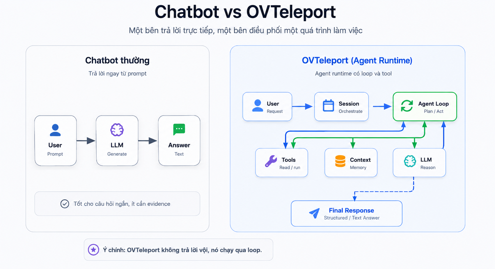

# 01. OVTeleport là gì?

## Mục tiêu

Sau phần này, người học cần trả lời được ba câu hỏi:

1. OVTeleport là gì?
2. Vì sao OVTeleport khác chatbot thường?
3. Khi nào một task cần agent runtime thay vì chỉ cần hỏi LLM trực tiếp?

Đây là phần mở đầu. Mục tiêu chưa phải đi sâu vào implementation, mà là xây đúng mental model trước khi học core flow, agent loop, tool calls, memory và permission.

## Vấn đề bắt đầu từ đâu?

Với câu hỏi đơn giản, chatbot thường là đủ:

```text
User: "Giải thích debounce là gì?"
AI: trả lời bằng text.
```

Nhưng với task kỹ thuật dài hơn, ví dụ:

```text
Audit module auth và đề xuất cách fix.
```

Một câu trả lời trực tiếp là chưa đủ. Agent cần biết module nằm ở đâu, đọc file thật, kiểm tra test, quan sát output, cập nhật kết luận và chỉ tổng hợp final response khi đã có evidence.

Đó là lý do cần OVTeleport.

## Định nghĩa ngắn gọn

OVTeleport là một **AI Agent Runtime**. Nó giúp AI không chỉ trả lời như chatbot, mà có thể xử lý một task qua nhiều bước:

```text
Hiểu yêu cầu
-> Lập kế hoạch
-> Gọi tool
-> Quan sát kết quả
-> Cập nhật context
-> Tổng hợp final response
```

Nói ngắn hơn:

```text
Chatbot thường:
User hỏi -> AI trả lời

OVTeleport:
User yêu cầu -> Orchestrator điều phối -> Agent Loop xử lý
-> Tool calls / Memory / LLM phối hợp -> Final Response
```

## Sơ đồ đối chiếu Chatbot và OVTeleport



Sơ đồ này cho thấy khác biệt cốt lõi: chatbot thường đi thẳng từ user prompt đến answer, còn OVTeleport tạo session rồi đưa task vào Agent Loop. Loop có thể dùng tool, context và LLM nhiều lần trước khi tổng hợp final response.

Điểm quan trọng: OVTeleport không thay thế LLM. Nó đặt LLM vào một runtime có khả năng làm việc, quan sát và kiểm soát hành động.

## OVTeleport giải quyết việc gì?

OVTeleport phù hợp với các task có một hoặc nhiều đặc điểm sau:

- Cần nhiều bước xử lý.
- Cần đọc dữ liệu thật từ workspace.
- Cần gọi tool như search file, read file, run command hoặc API.
- Cần giữ mạch trong một session dài.
- Cần final response dựa trên evidence thay vì đoán.
- Cần permission boundary cho hành động có side effect.

Ví dụ task phù hợp:

- Phân tích source code.
- Audit lỗi hoặc rủi ro trong module.
- Đề xuất kế hoạch fix.
- Tóm tắt kết quả tool thành báo cáo dễ hiểu.
- Theo dõi một workflow dài có nhiều bước trung gian.

OVTeleport không chỉ là UI chat. Core nằm ở cách runtime điều phối session, agent loop, tool calls, context, provider và permission.

## Vì sao chatbot thường chưa đủ?

Chatbot thường mạnh ở trả lời trực tiếp. Nhưng với task như “audit module auth”, chatbot không nên đoán từ trí nhớ hoặc từ vài dòng context ban đầu.

Một agent runtime cần làm tốt bốn việc mà chatbot trực tiếp thường thiếu:

1. **State**: biết task đang ở bước nào.
2. **Action**: gọi tool để tương tác với môi trường thật.
3. **Observation**: đọc kết quả thật và cập nhật hướng xử lý.
4. **Control**: kiểm soát permission, cost, context và final response.

Nếu thiếu bốn phần này, hệ thống dễ trở thành một chatbot nói rất thuyết phục nhưng không có bằng chứng.

## Ví dụ: audit module auth

User yêu cầu:

```text
Audit module auth và đề xuất cách fix.
```

OVTeleport không nên trả lời ngay. Runtime có thể điều phối agent làm các bước:

1. Tạo hoặc resume session cho task audit.
2. Xác định module auth nằm ở đâu.
3. Đọc implementation và test liên quan.
4. Search nơi module auth được gọi.
5. Quan sát kết quả tool.
6. Reflect xem evidence đã đủ chưa.
7. Nếu cần, hỏi permission để chạy test hoặc đọc thêm file.
8. Tổng hợp final response có vấn đề, mức độ nghiêm trọng, file liên quan và kế hoạch fix.

Điểm khác biệt là final response không xuất hiện ngay sau prompt. Nó là kết quả của một quá trình có thể quan sát và kiểm soát.

## Chatbot vs OVTeleport

| Tiêu chí | Chatbot thường | OVTeleport |
|---|---|---|
| Cách xử lý | Trả lời trực tiếp | Chạy qua runtime nhiều bước |
| Tool | Thường không có hoặc rất hạn chế | Tool calls là core |
| Context | Chủ yếu là hội thoại | Session context + working memory |
| Task dài | Dễ mất mạch | Có session và agent loop |
| Evidence | Phụ thuộc vào prompt | Có thể đọc file, chạy tool, quan sát output |
| Safety | Chủ yếu nằm ở prompt/UI | Có permission boundary trong runtime |
| UX | Chat text | Có thể có timeline/progress |

## OVTeleport không phải là gì?

Để tránh hiểu sai:

- OVTeleport không chỉ là một giao diện chat đẹp hơn.
- OVTeleport không phải chỉ là một prompt dài.
- OVTeleport không phải cứ dùng model mạnh là tự thành agent tốt.
- OVTeleport không có nghĩa là cho AI tự do chạy mọi thứ.
- OVTeleport không nên nhét toàn bộ repository vào context.

Một agent runtime tốt cần phối hợp model, tool, context, session, permission và observability. Model là phần rất quan trọng, nhưng không phải toàn bộ hệ thống.

## Câu cần nhớ

```text
Chatbot trả lời.
OVTeleport điều phối một quá trình làm việc.
```

OVTeleport biến LLM từ “hệ thống sinh câu trả lời” thành một agent runtime có thể lập kế hoạch, hành động có kiểm soát, quan sát evidence và tổng hợp kết quả cuối cùng.
