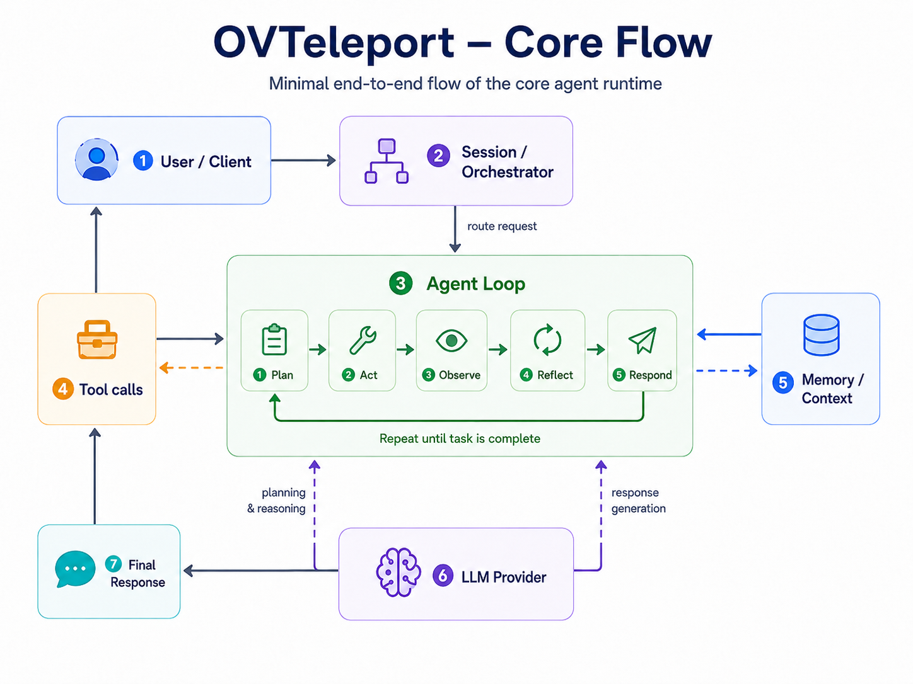

# 02. Core Flow của OVTeleport

## Mục tiêu

Sau phần này, người học cần nắm được:

1. Request của user đi vào OVTeleport như thế nào.
2. Vì sao `Agent Loop` là trung tâm của runtime.
3. Tool calls, Memory / Context và LLM Provider phối hợp với Agent Loop ra sao.
4. Vì sao Final Response là kết quả tổng hợp, không phải log thô hoặc câu trả lời trực tiếp từ model.

Phần trước giúp trả lời câu hỏi “OVTeleport là gì?”. Phần này trả lời câu hỏi tiếp theo: **khi user gửi một request, OVTeleport xử lý request đó qua những thành phần nào?**

## Ý tưởng trung tâm

Core flow của OVTeleport không phải là một pipeline một chiều kiểu:

```text
User -> LLM -> Answer
```

OVTeleport là một agent runtime. Runtime tạo session, đưa task vào Agent Loop, cho phép agent gọi tool, dùng context, gọi LLM provider, quan sát kết quả và lặp lại cho đến khi đủ điều kiện trả lời.

Đường chính có thể hiểu đơn giản như sau:

```text
User / Client
-> Session / Orchestrator
-> Agent Loop
-> Final Response
```

Trong quá trình chạy, `Agent Loop` có thể sử dụng ba nhóm năng lực:

```text
Tool calls        : tương tác với môi trường thật
Memory / Context  : giữ mạch và chọn thông tin liên quan
LLM Provider      : planning, reasoning, summarization, response generation
```

Điểm quan trọng: `Tool calls`, `Memory / Context` và `LLM Provider` không phải ba bước tuyến tính cố định. Chúng là các thành phần mà Agent Loop có thể dùng nhiều lần trong một task.

## Sơ đồ core flow



Sơ đồ này là bản đồ runtime ở mức nền tảng. Hãy đọc nó theo hướng sau:

- `1. User / Client`: nơi user gửi yêu cầu và nhận kết quả cuối cùng.
- `2. Session / Orchestrator`: tạo hoặc resume session, chuẩn bị context ban đầu và route request vào runtime.
- `3. Agent Loop`: lõi xử lý task qua nhiều bước.
- `4. Tool calls`: lớp hành động thật như search file, read file, run command hoặc gọi API.
- `5. Memory / Context`: nơi lưu và chọn thông tin cần thiết cho bước xử lý hiện tại.
- `6. LLM Provider`: lớp gọi model cho planning, reasoning, summarization và response generation.
- `7. Final Response`: kết quả đã được tổng hợp cho user.

Sơ đồ không có nghĩa là mọi request luôn đi qua tất cả khối theo đúng một thứ tự cố định. Một task đơn giản có thể cần rất ít tool. Một task audit code có thể gọi tool nhiều lần, cập nhật context nhiều lần và gọi provider nhiều lần trước khi final.

## Vai trò của từng khối

### 1. User / Client

User / Client là điểm vào của hệ thống. Client có thể là CLI, TUI, Web App, IDE Extension hoặc API Client.

Ví dụ request:

```text
Audit module login và cho tôi kế hoạch fix.
```

Client không cần tự biết agent sẽ làm bao nhiêu bước. Trách nhiệm chính của client là gửi request, hiển thị trạng thái phù hợp và nhận Final Response.

### 2. Session / Orchestrator

Session / Orchestrator là lớp điều phối.

Nó trả lời các câu hỏi:

- Đây là session mới hay session đang được resume?
- Request này cần context ban đầu nào?
- Runtime nên bắt đầu Agent Loop từ đâu?
- Tool results, permission decision và kết luận trung gian sẽ được lưu ở đâu?

Orchestrator không thay Agent Loop để giải quyết toàn bộ task. Nó giữ mạch làm việc, quản lý session và đưa request vào đúng runtime path.

### 3. Agent Loop

Agent Loop là trung tâm của OVTeleport.

Một loop cơ bản gồm:

```text
Plan -> Act -> Observe -> Reflect -> Respond
```

Trong một task thật, loop có thể diễn ra như sau:

1. `Plan`: hiểu mục tiêu và chọn bước tiếp theo.
2. `Act`: gọi tool, gọi provider hoặc đọc context.
3. `Observe`: nhận kết quả thật từ tool, provider hoặc memory.
4. `Reflect`: đánh giá đã đủ thông tin chưa.
5. `Respond`: tổng hợp final response khi đã đủ điều kiện.

Nếu chưa đủ evidence, Agent Loop quay lại bước phù hợp thay vì trả lời vội.

### 4. Tool calls

Tool calls giúp agent tương tác với môi trường thật.

Ví dụ:

- Search file liên quan đến `login`.
- Read `src/auth/login.ts`.
- Run test auth nếu được phép.
- Gọi API hoặc lấy logs.
- Sửa file nếu permission cho phép.

Tool call phải được kiểm soát bằng schema, validation, permission, execution boundary và output capture. Đây là điểm biến agent từ “nói về việc cần làm” thành “có thể làm việc có kiểm soát”.

### 5. Memory / Context

Memory / Context giúp Agent Loop không mất mạch.

Context có thể gồm:

- User request hiện tại.
- Lịch sử session.
- File đã đọc.
- Tool results gần đây.
- Kết luận tạm thời.
- Permission decision.
- Policy hoặc instruction liên quan.

Context tốt không phải là đưa mọi thứ vào model. Context tốt là chọn đúng thông tin cho bước hiện tại, đủ ngắn để nằm trong token budget và đủ rõ để model ra quyết định đúng.

### 6. LLM Provider

LLM Provider là lớp gọi model AI.

Provider thường được dùng cho:

- Lập kế hoạch.
- Phân tích kết quả tool.
- Tóm tắt output dài.
- Review hoặc classification.
- Tạo Final Response.

Provider abstraction giúp runtime không phụ thuộc cứng vào một API cụ thể. Bên dưới có thể là OpenAI-compatible provider, OpenRouter, Together, Anthropic, Google hoặc local model, nhưng runtime vẫn làm việc với một contract chung.

### 7. Final Response

Final Response là kết quả cuối cùng user đọc.

Nó nên là synthesis từ toàn bộ quá trình:

- Request ban đầu.
- Plan đã chạy.
- Tool results.
- Observations.
- Context liên quan.
- Reasoning hoặc summary từ LLM Provider.

Final Response không nên là raw log. Nó cần rõ ràng, có kết luận, có evidence khi cần và có bước tiếp theo nếu task chưa kết thúc hoàn toàn.

## Ví dụ flow: audit module login

User gửi request:

```text
Audit module login và cho tôi kế hoạch fix.
```

OVTeleport có thể xử lý như sau:

```text
1. User / Client gửi request.
2. Session / Orchestrator tạo hoặc resume audit session.
3. Agent Loop lập plan: tìm implementation, dependency và test liên quan.
4. Agent Loop gọi tool search để tìm file login.
5. Tool trả kết quả: login.ts, session.ts, login.test.ts.
6. Context cập nhật danh sách file liên quan.
7. Agent Loop gọi tool read để đọc implementation và test.
8. Agent Observe: login flow rõ, nhưng chưa thấy rate limit hoặc lockout test.
9. Agent Reflect: cần đánh giá rủi ro và có thể cần chạy test.
10. Nếu cần command có side effect hoặc tốn thời gian, runtime hỏi permission.
11. LLM Provider hỗ trợ tổng hợp vấn đề, mức độ nghiêm trọng và kế hoạch fix.
12. Final Response trả về audit report cho user.
```

Điểm cần chú ý: final response không xuất hiện ngay sau request. Nó là kết quả của nhiều vòng quan sát và tổng hợp.

## Cách đọc đúng core flow

| Câu hỏi | Cách hiểu đúng |
|---|---|
| Ai nhận request đầu tiên? | User / Client gửi vào Session / Orchestrator |
| Ai xử lý task chính? | Agent Loop |
| Tool calls nằm ở đâu? | Là năng lực Agent Loop dùng để tương tác với môi trường thật |
| Memory / Context dùng để làm gì? | Giữ mạch và chọn thông tin liên quan cho bước hiện tại |
| LLM Provider có phải toàn bộ agent không? | Không. Provider là một phần trong runtime |
| Final Response đến từ đâu? | Từ synthesis của plan, tool results, observations, context và provider output |

## Lỗi hiểu sai cần tránh

1. **Hiểu core flow như pipeline một chiều**  
   Thực tế Agent Loop có thể lặp nhiều lần và gọi các thành phần theo nhu cầu.

2. **Coi LLM Provider là toàn bộ agent**  
   Model rất quan trọng, nhưng runtime, tool, context, session và permission mới tạo thành agent system.

3. **Coi tool call là function call đơn giản**  
   Tool call trong agent runtime cần validation, permission, execution boundary và output capture.

4. **Coi context càng nhiều càng tốt**  
   Context quá nhiều làm tăng chi phí và gây nhiễu. Context phải liên quan và đủ dùng.

5. **Coi final response là raw model output**  
   Final response tốt là bản tổng hợp đã được chọn lọc cho user.

## Câu cần nhớ

```text
Session điều phối.
Agent Loop xử lý.
Tool / Context / LLM hỗ trợ.
Final Response là synthesis.
```

Nếu phần đầu giúp phân biệt OVTeleport với chatbot, thì phần này cho thấy sự khác biệt đó được tổ chức thành core runtime flow như thế nào.
