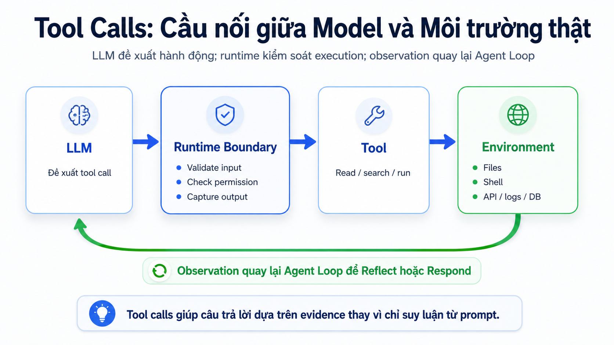

# 04. Tool Calls

## Mục tiêu

Sau phần này, người học cần hiểu được:

1. Tool calls là gì trong OVTeleport.
2. Vì sao LLM không nên tự được xem là “đã đọc file” hoặc “đã chạy command”.
3. Runtime boundary kiểm soát tool call như thế nào.
4. Vì sao tool result phải quay lại Agent Loop dưới dạng observation.

Phần Agent Loop đã nói về `Act` và `Observe`. Phần này đi sâu vào một loại action quan trọng nhất: **tool call**.

## Tool calls là gì?

Tool calls là cách agent tương tác với môi trường thật.

LLM tự nó chỉ sinh text hoặc đề xuất hành động. Nó không tự đọc được file trong workspace, không tự chạy command, không tự query database và không tự biết trạng thái mới nhất của project.

Tool call là cầu nối giữa ý định của model và hành động thật:

```text
Model muốn kiểm tra điều gì đó
-> Runtime kiểm soát request
-> Tool chạy trong boundary cho phép
-> Kết quả quay lại Agent Loop
```

Nhờ tool calls, OVTeleport có thể tạo câu trả lời dựa trên evidence thay vì chỉ suy luận từ prompt.

## Sơ đồ Tool Call Bridge



Sơ đồ này có bốn khối chính:

- `LLM`: đề xuất tool call hoặc lý do cần hành động.
- `Runtime Boundary`: validate input, kiểm tra permission và capture output.
- `Tool`: thực hiện hành động cụ thể như read, search hoặc run.
- `Environment`: nơi có dữ liệu thật như files, shell, API, logs hoặc database.

Ý chính: model không trực tiếp đụng vào môi trường thật. Runtime đứng giữa để kiểm soát mọi hành động.

## Vì sao cần tool calls?

Với task đơn giản, model có thể trả lời từ kiến thức và context hiện có. Nhưng với task kỹ thuật, câu trả lời đáng tin cần dữ liệu thật.

Ví dụ user hỏi:

```text
Audit module login.
```

Nếu không có tool, agent chỉ có thể đoán:

```text
Có thể module login thiếu rate limit.
```

Nếu có tool, agent có thể kiểm tra:

```text
Search file login.
Read src/auth/login.ts.
Read test/auth/login.test.ts.
Observe test coverage hiện có.
Kết luận thiếu rate limit dựa trên file thật.
```

Điểm khác biệt là evidence. Tool calls giúp agent chuyển từ “nghe có vẻ đúng” sang “có cơ sở kiểm tra”.

## Tool call hoạt động như thế nào?

Một flow cơ bản:

```text
1. Agent xác định cần hành động.
2. LLM hoặc runtime đề xuất tool call.
3. Runtime validate tool name và arguments.
4. Permission kiểm tra hành động có được phép không.
5. Tool chạy trong boundary được cho phép.
6. Runtime capture output, error, exit code hoặc metadata.
7. Result được lưu vào session.
8. Observation quay lại Agent Loop để Reflect hoặc Respond.
```

Ví dụ:

```text
Tool: search files
Input: query = "login", path = "src"
Output:
- src/auth/login.ts
- src/auth/session.ts
- test/auth/login.test.ts
```

Agent không dừng ở output này. Nó dùng output để quyết định bước tiếp theo:

```text
Reflect: cần đọc login.ts, session.ts và login.test.ts.
Next act: read các file liên quan.
```

## Runtime Boundary

Runtime Boundary là phần quan trọng nhất của tool calling.

Nó bảo đảm tool call không chạy một cách tùy tiện. Boundary này thường gồm:

- **Schema**: tool nhận input dạng nào.
- **Validation**: arguments có đúng type, đúng field, đúng path không.
- **Permission**: hành động được allow, deny hay cần ask user.
- **Execution boundary**: tool được chạy trong scope nào.
- **Output capture**: stdout, stderr, error, exit code hoặc result được ghi lại.
- **Session logging**: result được lưu để audit, resume và làm context.

Nếu thiếu boundary, “tool calling” dễ biến thành việc cho model chạy hành động ngoài kiểm soát.

## Tool result phải quay lại Agent Loop

Tool result không có giá trị nếu agent không quan sát và dùng nó để cập nhật hướng xử lý.

Ví dụ:

```text
Tool result: tìm thấy login.ts và session.ts.
```

Observation tốt:

```text
Có implementation login và dependency session.
Cần đọc cả hai file trước khi kết luận.
```

Observation yếu:

```text
Đã tìm thấy file.
```

Điểm cần nhớ: tool output là dữ liệu thô. Agent Loop cần biến nó thành observation có ý nghĩa.

## Permission và safety

Không phải tool call nào cũng có cùng mức rủi ro.

Ví dụ thường an toàn hơn:

- Search file trong workspace.
- Read file docs hoặc source trong scope cho phép.
- Đọc metadata không nhạy cảm.

Ví dụ cần kiểm soát chặt hơn:

- Sửa file.
- Chạy command tốn thời gian.
- Cài dependency.
- Gọi API ngoài.
- Xóa file hoặc thay đổi dữ liệu.

OVTeleport cần permission boundary vì tool có thể tạo side effect thật. Safety không nên chỉ nằm trong prompt hoặc text UI; nó phải nằm trong kiến trúc execution.

## Output quá dài thì xử lý thế nào?

Tool output có thể rất dài:

- Test log nhiều nghìn dòng.
- Search result quá rộng.
- File lớn.
- API response nhiều dữ liệu.

Runtime không nên đưa toàn bộ output vào model nếu không cần. Cách xử lý tốt hơn:

- Giữ phần lỗi chính.
- Truncate phần ít liên quan.
- Summarize output dài.
- Lưu raw result trong session nếu cần audit.
- Đưa vào context phần đủ dùng cho bước tiếp theo.

Mục tiêu là giữ evidence nhưng không làm nhiễu context.

## Ví dụ: audit login

User:

```text
Audit module login.
```

Agent có thể dùng tool calls như sau:

| Step | Tool call | Mục đích | Observation |
|---|---|---|---|
| 1 | Search `login` | Tìm file liên quan | Có `login.ts`, `session.ts`, `login.test.ts` |
| 2 | Read `login.ts` | Hiểu flow login | Login verify password rồi tạo session |
| 3 | Read `session.ts` | Kiểm tra session dependency | Session có expiry config |
| 4 | Read `login.test.ts` | Kiểm tra test coverage | Có success/failure, thiếu repeated failures |
| 5 | Run test auth nếu được phép | Xác nhận test hiện tại | Test pass nhưng chưa cover brute force |

Final response sau đó có thể nói:

```text
Rủi ro chính: chưa thấy rate limit/lockout cho repeated failed login.
Evidence: login flow tạo session sau password check; test hiện có chỉ cover success/failure cơ bản.
Kế hoạch fix: thêm rate limit, lockout/delay policy và test repeated failures.
```

## Tool calls không thay thế reasoning

Tool cung cấp dữ liệu thật, nhưng không tự kết luận thay agent.

Ví dụ `read login.ts` chỉ trả nội dung file. Agent vẫn phải:

- Hiểu flow.
- So sánh với yêu cầu audit.
- Nhận ra thiếu kiểm soát nào.
- Kiểm tra test coverage.
- Tổng hợp mức độ nghiêm trọng.

Nói cách khác:

```text
Tool cung cấp evidence.
Agent Loop quyết định evidence đó có nghĩa gì.
```

## Lỗi hiểu sai cần tránh

1. **LLM đã nói vậy nghĩa là đã kiểm tra**  
   Sai. Nếu chưa có tool result hoặc context thật, đó vẫn có thể chỉ là suy luận.

2. **Tool call chỉ là function call**  
   Không đủ. Tool call cần validation, permission, execution boundary, output capture và session logging.

3. **Tool chạy xong là task xong**  
   Sai. Tool result phải quay lại Agent Loop để Observe và Reflect.

4. **Output càng nhiều càng tốt**  
   Sai. Output quá dài làm nhiễu context. Cần chọn phần liên quan.

5. **Permission là chi tiết UI**  
   Sai. Permission là boundary runtime trước hành động thật.

## Câu cần nhớ

```text
Tool calls biến ý định của model thành hành động thật có kiểm soát.
Tool output quay lại Agent Loop dưới dạng observation.
Final response phải dựa trên evidence, không phải đoán.
```
