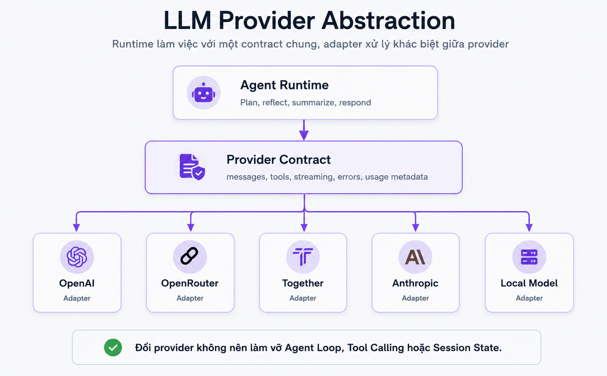

# 06. LLM Provider

## Mục tiêu

Sau phần này, người học cần hiểu được:

1. LLM Provider đóng vai trò gì trong OVTeleport.
2. Vì sao LLM không phải toàn bộ agent.
3. Provider abstraction giúp runtime không bị khóa vào một API cụ thể như thế nào.
4. Provider contract, adapter, streaming, tool call, error và usage metadata liên quan ra sao.

Phần Memory / Context đã nói về Context Manager: runtime chọn dữ liệu đúng để đưa vào model. Phần này nói về lớp tiếp theo: **runtime gọi model qua provider abstraction như thế nào**.

## LLM Provider là gì?

LLM Provider là lớp kết nối OVTeleport với model AI.

Runtime chuẩn bị request, context, tools và policy cần thiết. Sau đó Provider layer gửi request đó đến model provider và nhận lại:

- Text response.
- Streaming chunks.
- Tool call request.
- Error.
- Usage metadata.
- Finish reason hoặc stop reason.

LLM Provider cung cấp năng lực ngôn ngữ, nhưng nó không tự tạo thành agent. Agent cần runtime, session, agent loop, tool calls, context, permission và observability.

Nói ngắn gọn:

```text
LLM Provider = nơi gọi model.
Agent Runtime = nơi điều phối toàn bộ quá trình làm việc.
```

## LLM dùng để làm gì trong Agent Loop?

Trong OVTeleport, model có thể được gọi ở nhiều điểm:

| Phase | Provider có thể hỗ trợ |
|---|---|
| Plan | Phân rã task, chọn hướng xử lý |
| Act | Đề xuất tool call hoặc hành động tiếp theo |
| Observe | Tóm tắt output dài, rút ý chính |
| Reflect | Đánh giá evidence, phát hiện thiếu thông tin |
| Respond | Viết final response rõ ràng cho user |

Ví dụ task audit login:

```text
Plan: cần đọc login.ts, session.ts, login.test.ts.
Observe: tool output cho thấy thiếu test repeated failures.
Reflect: rủi ro brute force chưa được cover.
Respond: viết audit report và kế hoạch fix.
```

Model giúp suy luận và diễn đạt. Nhưng evidence vẫn nên đến từ tool results, context và observation thật.

## Vì sao cần Provider Abstraction?

Mỗi provider có API và format khác nhau:

- Format messages khác nhau.
- Streaming event khác nhau.
- Tool calling schema khác nhau.
- Error shape khác nhau.
- Usage metadata khác nhau.
- Model name và capability khác nhau.

Nếu runtime gọi trực tiếp một provider cụ thể ở khắp nơi, hệ thống sẽ khó:

- Đổi provider.
- Thêm fallback.
- Chuẩn hóa tool call.
- Kiểm soát usage/cost.
- Test runtime độc lập.
- Hỗ trợ local model hoặc OpenAI-compatible endpoint.

Provider abstraction tạo một contract chung để runtime không phụ thuộc cứng vào chi tiết từng API.

## Sơ đồ Provider Abstraction



Sơ đồ này có ba tầng chính:

- `Agent Runtime`: nơi Agent Loop cần planning, reflect, summarize hoặc respond.
- `Provider Contract`: contract chung cho messages, tools, streaming, errors và usage metadata.
- `Adapters`: lớp chuyển đổi giữa contract chung và từng provider cụ thể như OpenAI, OpenRouter, Together, Anthropic hoặc local model.

Điểm quan trọng: đổi provider không nên làm vỡ Agent Loop, Tool Calling hoặc Session State.

## Provider Contract gồm những gì?

Một provider contract tốt thường cần chuẩn hóa:

- **Messages**: system, user, assistant, tool result.
- **Model config**: model name, temperature, max tokens, stop condition.
- **Tools**: tool schema, tool choice, tool call arguments.
- **Streaming**: token chunks, tool call chunks, completion events.
- **Errors**: rate limit, auth error, timeout, invalid request, provider failure.
- **Usage metadata**: input tokens, output tokens, cost estimate nếu có.
- **Finish reason**: stop, length, tool call, error hoặc cancelled.

Runtime nên làm việc với contract này. Adapter chịu trách nhiệm chuyển contract sang format provider thật.

Ví dụ:

```text
Runtime request chuẩn
-> Provider adapter chuyển sang API format
-> Provider trả stream/text/tool call/error
-> Adapter normalize response
-> Runtime xử lý tiếp trong Agent Loop
```

## Adapter làm gì?

Adapter là lớp phiên dịch giữa OVTeleport và provider cụ thể.

Ví dụ cùng một ý định:

```text
Gọi model để summarize tool output.
```

Nhưng mỗi provider có thể yêu cầu:

- Tên field khác nhau.
- Cách gửi tool schema khác nhau.
- Cách stream tool call khác nhau.
- Cách báo lỗi khác nhau.

Adapter che giấu khác biệt đó khỏi Agent Runtime.

Nhờ adapter, Agent Runtime có thể nói:

```text
generateResponse(messages, tools, modelConfig)
```

thay vì biết từng chi tiết của OpenAI, OpenRouter, Together, Anthropic hoặc local runtime.

## Provider không quyết định toàn bộ policy

Provider chỉ là lớp gọi model. Nó không nên tự quyết định toàn bộ runtime policy.

Những quyết định sau nên thuộc runtime, workspace policy hoặc product policy:

- Model nào dùng cho task nào.
- Khi nào dùng model mạnh.
- Khi nào dùng model rẻ hơn.
- Khi nào fallback provider.
- Budget tối đa cho một request.
- Có cho phép gửi dữ liệu ra provider ngoài không.
- Tool nào được expose cho model.

Ví dụ:

```text
Task: viết final audit report.
Có thể dùng model mạnh hơn.

Task: tóm tắt test output dài.
Có thể dùng model rẻ hơn nếu policy cho phép.
```

Agent tốt không chỉ là dùng model mạnh. Agent tốt là dùng đúng model, đúng context, đúng tool và đúng policy.

## Provider và Tool Calling

Một số model có thể trả về tool call. Nhưng điều đó không có nghĩa provider được quyền execute tool.

Flow đúng:

```text
Provider trả tool call request
-> Runtime validate arguments
-> Permission evaluate
-> Tool execution
-> Tool result quay lại Agent Loop
-> Provider có thể được gọi tiếp với observation mới
```

Provider chỉ đề xuất hoặc encode tool call. Runtime mới quyết định tool có được chạy không.

Điểm này rất quan trọng cho safety: model không được tự cấp quyền hành động cho chính nó.

## Provider và Context

Provider chỉ nhìn thấy phần context runtime đưa vào.

Nếu context thiếu evidence, model có thể đoán. Nếu context quá dài, model có thể nhiễu.

Vì vậy Memory / Context và LLM Provider liên kết chặt với nhau:

```text
Context Manager chọn input đúng.
LLM Provider xử lý input đó.
Agent Loop dùng output để quyết định bước tiếp theo.
```

Provider output chỉ tốt khi input context đủ rõ và đúng scope.

## Error và fallback

Provider call có thể lỗi:

- API key sai.
- Rate limit.
- Timeout.
- Provider down.
- Model không hỗ trợ tool calling.
- Context vượt token limit.
- Stream bị ngắt.

Runtime cần normalize lỗi để Agent Loop hiểu được:

```text
Error type: rate_limit
Provider: openrouter
Retryable: true
Suggested action: retry later or fallback
```

Fallback cũng cần policy. Không phải lỗi nào cũng tự động đổi provider được, vì có thể liên quan đến cost, privacy hoặc capability.

## Usage metadata và cost

Provider abstraction nên trả về usage metadata khi có thể:

- Input tokens.
- Output tokens.
- Total tokens.
- Model name.
- Provider name.
- Latency.
- Estimated cost nếu hệ thống hỗ trợ.

Usage metadata giúp:

- Debug cost.
- Theo dõi latency.
- Chọn model phù hợp.
- Audit session.
- Tối ưu context budget.

Agent runtime production không nên xem provider call như hộp đen hoàn toàn.

## Ví dụ: audit login

Trong task audit login, Provider có thể được dùng như sau:

| Thời điểm | Provider làm gì | Context nên đưa vào |
|---|---|---|
| Plan | Gợi ý cần đọc implementation, dependency và test | User request + project summary ngắn |
| Observe | Tóm tắt test output dài | Command, exit code, lỗi chính |
| Reflect | Đánh giá thiếu evidence nào | Tool observations + working memory |
| Respond | Viết audit report | Kết luận, evidence, file liên quan, fix plan |

Provider không tự biết file thật. Nó chỉ phân tích phần runtime đưa vào.

## Lỗi hiểu sai cần tránh

1. **LLM Provider là agent**  
   Sai. Provider là lớp gọi model. Agent là runtime phối hợp loop, tool, context, permission và session.

2. **Đổi provider chỉ là đổi URL**  
   Không hẳn. Tool calling, streaming, errors và usage metadata có thể khác nhau.

3. **Model mạnh nhất luôn tốt nhất**  
   Sai. Model mạnh hơn có thể tốn hơn, chậm hơn và không cần thiết cho task nhỏ.

4. **Provider trả tool call thì tool được chạy ngay**  
   Sai. Runtime vẫn phải validate và permission trước execution.

5. **Error provider là lỗi chung chung**  
   Sai. Runtime nên phân loại lỗi để retry, fallback hoặc báo user đúng cách.

## Câu cần nhớ

```text
LLM Provider cung cấp năng lực ngôn ngữ.
Provider Contract giữ runtime ổn định.
Adapter xử lý khác biệt giữa provider.
Agent Runtime mới là nơi điều phối task.
```
