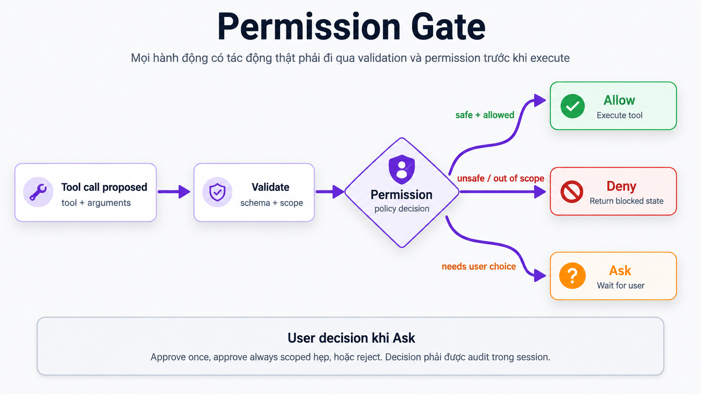

# 07. Permission & Tool Calls

## Mục tiêu

Sau phần này, người học cần hiểu được:

1. Vì sao tool calls cần permission boundary.
2. Permission nằm ở đâu trong flow execute tool.
3. Ba kết quả `allow`, `deny`, `ask` khác nhau thế nào.
4. Vì sao `approve always` phải scoped hẹp.
5. Permission decision cần được audit ra sao.

Phần Tool Calls đã nói tool calls là cầu nối giữa model và môi trường thật. Phần này tập trung vào phần bảo vệ cầu nối đó: **không phải tool call nào cũng được chạy ngay**.

## Ý tưởng trung tâm

Tool calls giúp agent hành động trong môi trường thật.

Điều đó cũng có nghĩa tool calls có thể tạo tác động thật:

- Đọc file nhạy cảm.
- Chạy command tốn thời gian.
- Gọi API ngoài.
- Sửa file.
- Xóa dữ liệu.
- Cài dependency.

Vì vậy, OVTeleport cần một permission gate trước execution.

Nguyên tắc chính:

```text
Control before autonomy.
Agent càng mạnh, permission càng phải rõ.
```

Permission không làm agent yếu đi. Permission làm agent có thể dùng được trong workspace thật mà vẫn kiểm soát được rủi ro.

## Permission nằm ở đâu?

Permission xuất hiện sau khi tool call đã được đề xuất và sau khi input đã được validate, nhưng trước khi tool được execute.

Flow đúng:

```text
Tool call proposed
-> Validate schema + scope
-> Permission evaluate
-> Allow / Deny / Ask
-> Execute hoặc Block
-> Audit decision
```

Điểm cần nhớ: model không được tự quyết định hành động nguy hiểm có được chạy hay không. Runtime và permission policy phải quyết định.

## Sơ đồ Permission Gate



Sơ đồ này thể hiện ba nhánh sau permission evaluation:

- `Allow`: hành động an toàn và đã nằm trong rule cho phép.
- `Deny`: hành động không an toàn hoặc vượt scope.
- `Ask`: cần user quyết định trước khi chạy.

Nếu validation hoặc permission không đạt, tool không được execute.

## Vì sao validate phải đứng trước permission?

Runtime cần biết tool call có hợp lệ không trước khi hỏi permission.

Ví dụ:

```text
Tool: read_file
Input: path = 12345
```

Input sai schema thì không nên hỏi user “có cho phép đọc file không?”. Runtime phải trả lỗi validation trước.

Thứ tự đúng:

```text
1. Tool name có tồn tại không?
2. Arguments đúng schema không?
3. Path hoặc command có đúng scope không?
4. Hành động này allow, deny hay ask?
```

Permission không thay thế validation. Validation kiểm tra request có hợp lệ không; permission kiểm tra request hợp lệ đó có được phép chạy không.

## Ba kết quả chính

### Allow

`allow` nghĩa là tool được chạy ngay theo rule hiện có.

Ví dụ phù hợp:

```text
Search file trong workspace.
Read tài liệu trong docs/.
Read source file thuộc scope task.
```

Allow nên dùng cho hành động ít rủi ro hoặc đã được scoped rõ.

### Deny

`deny` nghĩa là tool bị chặn.

Ví dụ nên deny mặc định:

```text
Xóa thư mục lớn.
Chạy command phá hủy.
Đọc secret ngoài scope.
Gửi dữ liệu nhạy cảm ra ngoài.
```

Deny không phải lỗi UX. Deny là cơ chế bảo vệ runtime khỏi hành động không an toàn.

### Ask

`ask` nghĩa là runtime cần user quyết định.

Ví dụ:

```text
Sửa file source.
Chạy test tốn thời gian.
Cài dependency.
Gọi API ngoài.
```

Ask nên hiển thị rõ:

- Tool nào muốn chạy.
- Input chính là gì.
- Scope tác động ở đâu.
- Vì sao agent cần chạy.
- Rủi ro chính là gì.

## User decision: once, always, reject

Khi permission ở trạng thái `ask`, user thường có ba lựa chọn:

- `once`: cho chạy một lần.
- `always`: cho phép về sau theo scope hẹp.
- `reject`: từ chối.

`always` là lựa chọn cần cẩn trọng nhất.

Ví dụ scoped tốt:

```text
Allow write trong docs/ovteleport-foundation/**
Allow run npm test trong package hiện tại
Allow read trong workspace hiện tại
```

Ví dụ scoped xấu:

```text
Allow toàn bộ shell command.
Allow write toàn bộ filesystem.
Allow network mọi domain.
```

Approve always quá rộng có thể khiến agent vượt khỏi task ban đầu mà user không nhận ra.

## Permission rule nên chứa gì?

Một permission rule thực tế nên cân nhắc:

- **Tool name**: tool nào được gọi.
- **Action type**: read, write, execute, network.
- **Path scope**: file hoặc folder nào.
- **Command scope**: command cụ thể nào nếu là shell.
- **Network scope**: domain hoặc API nào nếu có network.
- **Risk level**: safe, review, destructive.
- **Duration**: once, session-only, persistent.
- **Actor**: user hoặc policy nào đã approve.

Không phải hệ thống nào cũng implement đủ tất cả field này. Nhưng đây là mental model tốt để thiết kế permission boundary.

## Ví dụ: audit module login

User:

```text
Audit module login và đề xuất kế hoạch fix.
```

Agent muốn làm:

| Tool call | Permission | Lý do |
|---|---|---|
| Search file `login` | allow | Read-only, scope workspace |
| Read `src/auth/login.ts` | allow | Read-only, file liên quan task |
| Read `test/auth/login.test.ts` | allow | Read-only, evidence cho audit |
| Run `pnpm test auth` | ask | Command có thể tốn thời gian |
| Edit `src/auth/login.ts` | ask | Có side effect lên source code |
| Delete `src/auth` | deny | Hành động phá hủy, vượt nhu cầu audit |

Permission giúp user vẫn kiểm soát workspace dù agent có khả năng hành động.

## Permission decision phải được audit

Mỗi quyết định permission nên đủ để trả lời:

- Tool nào được gọi?
- Arguments chính là gì?
- Quyết định là `allow`, `deny` hay `ask`?
- Nếu user quyết định: `once`, `always` hay `reject`?
- Scope của approval là gì?
- Ai hoặc policy nào đưa ra quyết định?
- Tool có chạy thành công không?
- Output hoặc error chính là gì?

Audit trail giúp:

- Debug vì sao agent dừng.
- Review hành vi agent.
- Truy vết hành động có side effect.
- Giải thích cho user vì sao runtime hỏi permission.

## Permission và UX

Permission tốt không chỉ là bảo mật. Nó cũng là UX.

Prompt permission nên ngắn nhưng đủ thông tin:

```text
Tool: run_command
Command: pnpm test auth
Reason: verify auth tests before final audit.
Risk: command may take time and execute project scripts.
Decision: approve once / approve always for this command / reject
```

Không nên chỉ hiển thị:

```text
Agent wants to run a command. Allow?
```

User cần biết agent muốn làm gì và tác động ở đâu.

## Lỗi thiết kế thường gặp

1. **Cho model tự quyết định permission**  
   Sai. Model có thể đề xuất hành động, nhưng runtime phải quyết định quyền chạy.

2. **Approve always quá rộng**  
   Đây là lỗi nguy hiểm vì user có thể mất kiểm soát scope.

3. **Không phân biệt read và write**  
   Read-only và write có mức rủi ro rất khác nhau.

4. **Không log decision**  
   Không có audit trail thì khó debug và khó giải thích hành vi agent.

5. **Hỏi user quá nhiều cho hành động an toàn**  
   Permission quá ồn làm UX kém. Hành động an toàn, scoped rõ nên có thể allow theo policy.

6. **Coi permission là popup UI**  
   Permission phải là boundary runtime. UI chỉ là cách hiển thị decision khi cần user chọn.

## Câu cần nhớ

```text
Tool call có thể tạo tác động thật.
Validation kiểm tra request có hợp lệ không.
Permission kiểm tra request hợp lệ đó có được phép chạy không.
Allow / Deny / Ask phải rõ scope và audit được.
```
